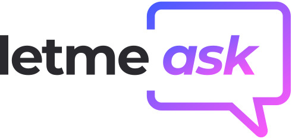

# LetMeAsk
<h1 align="center">
    
</h1>

<h4 align="center"> 
	Plataforma desenvolvida na semana NLW Together oferecida pela RocketSeat 🚀 | Em construção 🚧 
</h4>

  
  
  
	
  

# Descrição do Projeto

O LetMeAsk foi pensado para que usuários possam criar/interagir em salas temáticas, através de perguntas os usuários se comunicam com o dono da sala proporcionando ao criador melhor gestão.

## ⚙️ Funcionalidades

- [x] Sistema de Login com Google
- [x] Criação de salas temáticas
- [x] Destaque de perguntas
- [x] Marcação de perguntas como respondida
- [x] Encerramento da sala
- [x] Criação de perguntas
- [x] Opção de like
